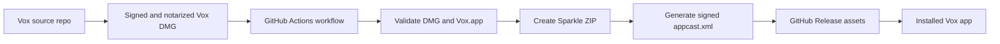

# Release Flow

## Architecture



## Validation Job

The `Publish Sparkle Update` workflow runs on a macOS runner. It:

1. downloads or copies the DMG
2. mounts the DMG read-only
3. finds `Vox.app`
4. validates `Info.plist`, Sparkle keys, bundle ID, version, architecture, framework staging, and executable rpath
5. validates Developer ID signing, Gatekeeper acceptance, and stapled notarization tickets
6. creates `Vox-<version>-<arch>.zip` with `ditto --keepParent`
7. copies committed release notes or downloads release notes from
   `release_notes_url`, when provided
8. generates signed `appcast.xml` with Sparkle `generate_appcast`
9. fails if the appcast is missing `sparkle:edSignature`

## Publish Job

The workflow publishes the prepared assets to a GitHub Release tagged as
`v<CFBundleShortVersionString>`.

The app's feed URL is stable:

```text
https://github.com/FrancisBourre/Vox/releases/latest/download/appcast.xml
```

Each appcast points at an immutable release asset URL:

```text
https://github.com/FrancisBourre/Vox/releases/download/v<version>/Vox-<version>-<arch>.zip
```

## Access Requirement

Sparkle runs on employee machines, outside CI, so the final appcast and ZIP URLs
must be reachable without per-user credentials. This repository is public and
contains no Vox source code; Sparkle's EdDSA signature verifies update integrity.
